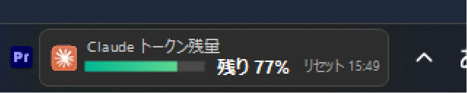
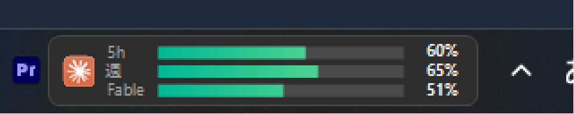
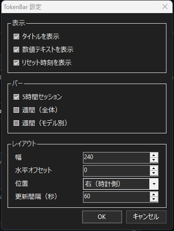

# TokenBar

Windows 11 のタスクバーに Claude Code のトークン残量を常時表示する、軽量なウィジェット。

(English README: [README.md](README.md))



マルチバーモード（5時間セッション / 週間 / モデル別）と設定ウィンドウ:





---

## 機能

- **メイン表示** — 5時間セッションウィンドウの残り％ + プログレスバー + リセット時刻をタスクバー上に常時表示。
- **ホバーツールチップ** — 週間使用量（全モデル合計 / モデル別内訳）とリセット時刻を表示。
- **設定ウィンドウ**（左クリック）— タイトル・数値テキスト・リセット時刻の表示を個別に切り替え可能。表示するバーを選択: 5時間セッション、週間（全体）、週間モデル別。
- **正確なデータ** — Claude Code の `/usage` コマンドと同じ OAuth エンドポイント（`GET https://api.anthropic.com/api/oauth/usage`）を主データ源として使用。認証には `~/.claude/.credentials.json` に保存済みのトークンを利用。
- **自動フォールバック** — API が利用できない場合は `~/.claude/projects/**/*.jsonl` のトランスクリプトを解析し、現在の5時間ブロックの使用量を推計（ccusage 方式）。
- **フルスクリーン時に自動非表示** — ゲームやプレゼン中はウィジェットを自動的に隠す。
- **Explorer 再起動に対応** — Explorer が再起動されてもウィジェットが自動的に復帰。
- **単一インスタンス** — 二重起動を防ぐ（既に起動中の場合、2つ目は即終了する）。
- **レート制限対応** — HTTP 429 時は `Retry-After` を尊重してバックオフし、直前の正常な API 値を表示し続ける（粗いローカル推計に飛ばない）。
- **日本語 / 英語 UI** — OS の表示言語に自動で追従。
- **依存関係ゼロ** — 約 50KB の単一 `.exe` ファイル。Windows に標準搭載の .NET Framework 4.8 を使用するため、ランタイムのインストール不要。

---

## 必要環境

- Windows 10 または 11
- .NET Framework 4.8（Windows 10 1903 以降・Windows 11 全エディションに標準搭載）
- Claude Code がインストール済みでログイン済みであること（`~/.claude/.credentials.json` が存在すること）

---

## インストール

### 方法 A — exe をダウンロード

[Releases](../../releases) ページから `TokenBar.exe` をダウンロードして実行するだけ。

### 方法 B — ソースからビルド

SDK は不要。コンパイラ（`csc.exe`）は Windows に標準搭載されています。

```powershell
powershell -File build.ps1
```

または手動でコンパイル:

```powershell
& "$env:WINDIR\Microsoft.NET\Framework64\v4.0.30319\csc.exe" /nologo /target:winexe /platform:x64 /optimize+ `
  /out:TokenBar.exe `
  /r:System.dll /r:System.Core.dll /r:System.Drawing.dll /r:System.Windows.Forms.dll /r:System.Web.Extensions.dll `
  Program.cs Config.cs UsageReader.cs ApiUsageReader.cs AppContext.cs WidgetForm.cs Strings.cs AssemblyInfo.cs
```

---

## 使い方

```powershell
.\TokenBar.exe          # ウィジェット起動（多重起動防止付き）
.\TokenBar.exe --dump   # 診断情報を dump.txt に書き出して終了
```

| 操作 | 動作 |
|------|------|
| 左クリック | 設定ウィンドウを開く |
| 右クリック | コンテキストメニュー: 設定 / 更新 / 設定ファイルを開く / 設定再読み込み / スタートアップ登録 / 終了 |

更新は右クリックのコンテキストメニューからも実行できます。

---

## 設定

`config.json` は初回起動時に exe と同じ場所へ自動生成されます。テキストエディタで編集し、右クリックメニューの **設定再読み込み** で反映できます（再起動不要）。

| キー | 既定値 | 説明 |
|------|--------|------|
| `tokenLimit` | `200000` | ローカル推計（フォールバック）モードで使用する5時間ブロックのトークン上限 |
| `includeCacheRead` | `false` | ローカル推計に `cache_read` トークンを含めるか |
| `refreshSec` | `60` | データ更新間隔（秒） |
| `position` | `"right"` | ウィジェットを配置するタスクバー側。`"right"` = 時計の近く、`"left"` = スタートボタンの近く |
| `offsetX` | `0` | 追加の水平オフセット（論理ピクセル、正値 = 中央方向に移動） |
| `widgetWidth` | `240` | ウィジェット幅（論理ピクセル、有効範囲: 160〜400） |
| `selectedModels` | `[]` | モデル別バーに表示するモデル名の配列。空 = API から取得した全モデル |
| `monitor` | `0` | ウィジェットを表示するディスプレイ。`0` = プライマリ、それ以外は Windows のディスプレイ番号 |
| `claudeDir` | `""` | `.claude` ディレクトリのパス。空の場合は `%USERPROFILE%\.claude` を使用 |
| `embed` | （予約） | 表示方式フラグ（予約済み、変更不要） |
| `showTitle` | `true` | タイトルテキストを表示する |
| `showValueText` | `true` | 数値パーセンテージ / トークン残量テキストを表示する |
| `showResetTime` | `true` | バー下部のリセット時刻テキストを表示する |
| `showSessionBar` | `true` | 5時間セッションのプログレスバーを表示する |
| `showWeeklyBar` | `false` | 週間（全モデル合計）のプログレスバーを表示する |
| `showModelBars` | `false` | API が返すモデルごとの週間バーを個別に表示する |

---

## 仕組み

### 主データ源 — OAuth usage API

TokenBar は以下のエンドポイントを呼び出します。

```
GET https://api.anthropic.com/api/oauth/usage
Authorization: Bearer <~/.claude/.credentials.json のトークン>
```

これは Claude Code の `/usage` コマンドが使用するのとまったく同じエンドポイントです。レスポンスには全モデルの正確なセッション使用量と週間使用量が含まれます。

### フォールバック — ローカルトランスクリプト推計

API 呼び出しが失敗した場合（オフライン、トークン期限切れなど）、ウィジェットは `~/.claude/projects/**/*.jsonl` をスキャンし、現在の5時間ブロックを特定してトークン使用量を合計します。`ccusage` などのツールと同じアプローチです。精度はアカウントの実際の上限と `tokenLimit` の一致度に依存します。

### 描画方式

Windows 11 の XAML タスクバーは古典的な `SetParent` による子ウィンドウ埋め込みを上から描画してしまうため、従来のタスクバー埋め込みは信頼性が低くなっています。TokenBar は代わりに **TOPMOST オーバーレイ**方式を採用し、タスクバー上に精密に配置します（ElevenClock と同じ手法）。フルスクリーンアプリを検出すると自動的に非表示になります。

### ソースファイル構成

| ファイル | 役割 |
|----------|------|
| `Program.cs` | エントリポイント（DPI 対応、単一インスタンス、`--dump` フラグ） |
| `AppContext.cs` | タイマー管理、ウィジェット生存監視（Explorer 再起動対応）、スタートアップ登録 |
| `WidgetForm.cs` | 描画、タスクバー上への TOPMOST オーバーレイ配置、フルスクリーン時自動非表示 |
| `ApiUsageReader.cs` | OAuth usage API リーダー（主データ源） |
| `UsageReader.cs` | JSONL トランスクリプト解析（フォールバックデータ源） |
| `Config.cs` | `config.json` の読み書き |
| `Strings.cs` | ローカライズされた UI 文字列（日本語 / 英語） |

---

## プライバシーとセキュリティ

- すべての処理は**ローカルマシン上**で完結します。
- OAuth トークンは Claude Code 自身の認証情報ファイル（`~/.claude/.credentials.json`）から読み取ります。このトークンは `api.anthropic.com` への単一の HTTPS リクエストにのみ使用され、ログに記録されることも、他の場所に書き込まれることも、他のサーバーに送信されることもありません。
- テレメトリなし。サードパーティサーバーなし。ネットワーク通信は更新サイクルごとの API 呼び出し1件のみ。

---

## トラブルシューティング

| 症状 | 原因と対処 |
|------|-----------|
| ウィジェットが表示されない | タスクバーの自動非表示が有効な場合、タスクバー端にカーソルを移動してください。またフルスクリーンアプリが起動中でないか確認してください。 |
| エラーテキストが表示される | Claude Code にログインしていないか、`~/.claude/.credentials.json` が存在しません。Claude Code にサインインしてウィジェットを再起動してください。 |
| 表示されるパーセンテージがおかしい | API が利用できないためフォールバックモードで動作しています。アカウントの実際の5時間トークン上限に合わせて `config.json` の `tokenLimit` を設定してください。 |

---

## 免責事項

本ツールはコミュニティが制作した**非公式ツール**であり、Anthropic との提携・後援・公式承認はありません。「Claude」は Anthropic PBC の商標です。本ウィジェットが使用する usage エンドポイントは非公開であり、公式 API 契約の一部ではありません。予告なく変更または廃止される可能性があります。

---

## ライセンス

MIT — [LICENSE](LICENSE) を参照。
